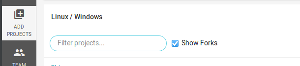
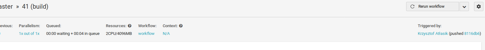
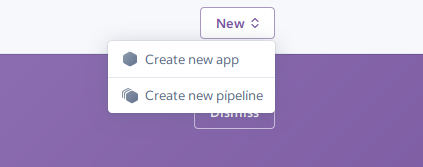
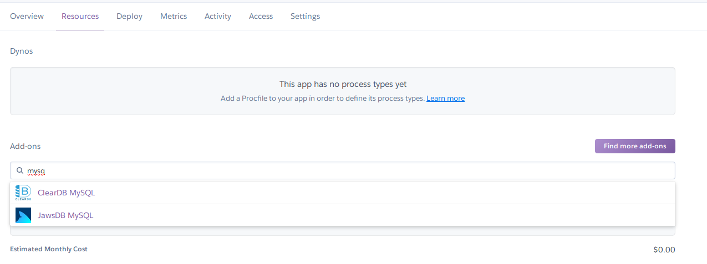

###### Jak doprowadzić projekt do szczęśliwego końca?

* Rozpoczynamy od stworzenia działającego projektu zapewniającego minimalne funkcje.
Takie podejścia nazywa się budowaniem **MVP** (*ang. minimum viable product*).
W tym celu stawiamy sobie kolejne cele, które będą budować nasz **MVP** i staramy się je spełniać w kolejnych cyklach. Wynikiem każdego kolejnego cyklu powinna być działająca aplikacja zawierająca nową funkcję.

* Staramy się koncentrować na dodawaniu tylko tych funkcji, które będą nam potrzebne, ignorujemy te, które hipotetycznie przydadzą nam się w przyszłości **YAGNI** (*ang. you're not going to need it*).

---

###### Co powienien mieć nasz projekt?

* Nasz projekt powienien być hostowany na publicznie dostępnym serwisie, takim jak **github**.

* Nasz projekt powinniśmy tworzyć w ten sam sposób, jakbyśmy pracowali nad aplikacją przeznaczoną do udostępnienia użytkownikom (*tzn. aplikacja produkcyjna*).

* Projekt powienien zawierać plik **.gitignore**, który zabezpiecza nas przez dodanie zbędnych plików do repozytorium. 

* Podczas tworzenia z projektu, możemy korzystać z przydatnych funkcji biblioteki **Hibernate**, takich, jak:

   * **spring.jpa.hibernate.ddl-auto=create-drop** - tworzenie tabel bazy danych z klas encji
   * **spring.jpa.show-sql=true** - pokazywanie kodu *SQL* tworzonego przez *Hibernate*.

W związku z tym, że nasza aplikacja ma być *produkcyjna*, to te ustawienia nie mogą znaleźć się z ostatecznej wersji naszej aplikacji. 

---

* Skrypty dokonujące zmian w bazie danych powinny być przechowywane w repozytorium. Aby zapewnić automatyczne uruchamianie tych skryptów podczas startu aplikacji możemy użyć biblioteki **Flyway**, która jest zintegrowana ze **Spring Boot** i będzie uruchamiała skrypty podczas uruchamiania aplikacji.

* Pisząc naszą aplikację powinniśmy też zadbrać o odpowiednią jakość kodu i pokrycie testami, tak jak robilibyśmy to podczas tworzenia aplikacji produkcyjnej.

* Nasza aplikacja powinna posiadać plik **README.md**, który będzie zawierał wszystkie informacje konieczne do skonfigurowania i uruchomienia aplikacji, uruchomiania testów itd. Przykładowany plik README znajduje się w repozytorum przykładowej aplikacji. 

---

* Opcjonalnie możemy wprowadzić możliwość zdalnego budowania naszej aplikacji przy pomocy serwisu [circleci](https://circleci.com/dashboard).
W tym celu musimy połączyć nasze konto na serwisie **github** z kontem na **circleci**, a następnie musimy wybrać odpowiednie repozytorium.
Następnie musimy dodać do projektu plik **.circleci/config.yml** zawierający konfigurację dla ciągłej integracji. Przykładowy [skrypt](https://github.com/katlasik/board/blob/master/.circleci/config.yml) znajduje się w repozytorum poglądowej aplikacji. 

W kolejnym kroku możemy dodać do pliku **README.md** znacznik oznaczający czy budowanie projektu się powiodło. Adres znacznika możemy pobrać klikając z znaczek trybu znajdujący się w prawym górnym rogu podsumowania, a następnie otwierając zakładkę **Status Badges**.

---

* Opcjonalnie możemy również opublikować naszą aplikację w internecie używająć serwisu [Heroku](https://www.heroku.com/).

   * Najpierw musimy stworzyć nową aplikację poprzez menu **New > Create New App**.
     
   * Kolejnym krokiem jest dodanie bazy danych do naszej aplikacji w zakładce **Resources**.
     
   * Następnie możemy połączyć naszą aplikację z kontem **github** w zakładce **Deploy** oraz uruchomić naszą aplikację poprzez przycisk **Deploy Branch**.

---

Zalążek do projektu do ściągnięcia znajduje się pod linkiem
https://github.com/katlasik/board/archive/example.zip.

---

    &nbsp;&nbsp;&nbsp;<a href="https://github.com/katlasik">https://github.com/katlasik</a>

     &nbsp;&nbsp;&nbsp;<a href="mailto:krzysztof.atlasik@pm.me">krzysztof.atlasik@pm.me</a>

